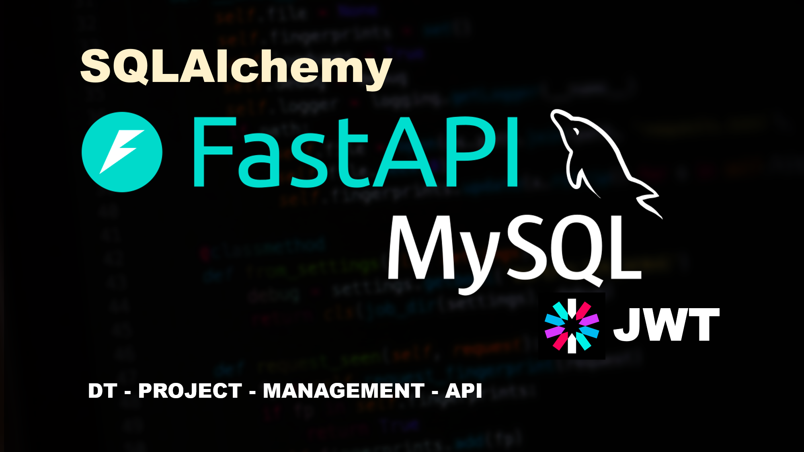
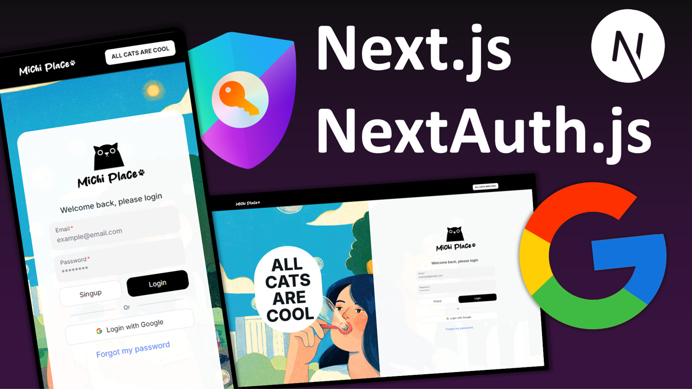

<h1 align="center">Hi, I'm <a href="https://github.com/DiegoTineo">Diego</a> 👋</h1>

<div align="center">
  
</div>

<p align="center">
  <a href="https://www.linkedin.com/in/diego-tineo-4a0526137/?trk=opento_sprofile_details" target="_blank">
    
  </a>
</p>

# About me

Full Stack Developer | JavaScript, TypeScript, Python. Experienced in Agile methodologies such as Scrum and software design applying DDD. ⭐

I have had the opportunity to collaborate with companies in various sectors, developing inventory management systems (ERP), point of sale (POS), order taking for restaurants and vehicle control systems for parking lots.

I am currently working as a Full Stack Developer at Somos Sistemas.

I am committed to continuous learning. Programming is my greatest passion❤️

```javascript
const diego = {
    code: ["HTML", "CSS", "Javascript", "Typescript", "Python"],
    frameworks: ["NextJS", "Express", "Tailwind", "Flask"],
    databases: ["MySQL", "PostgresQL", "MariaDB"],
    tools: ["Git", "Asana", "Trello", "Slack"],
    others: ["DDD", "MVC"],
    hobbies: ["Reading", "Football", "Music", "Learn"],
};
```

<!--
# Current hobby project

## Project management API

<a href="https://github.com/DiegoTineo/dt-project-management"></a>
-->

# Personal Projects

<table>
  <tr>
    <td width="50%">
      <h3 align="center">Michi Place</h3>
      <h5 align="center">💻 Next.js | NextAuth | Google | Tailwind | Zod  ...</h5>  
      <div align="center">
        <a href="https://github.com/DiegoTineo/michi-place" target="_blank">
          
        </a>
        <p>
          <a href="https://github.com/DiegoTineo/michi-place" target="_blank">
            
          </a>
          <!-- <a href="" target="_blank">
            
          </a> -->
        </p>
        <p>
          Frontend development project designed to practice using <strong>NextAuth</strong> and the <strong>Google authentication</strong> provider. Through an intuitive interface, this project allows simulating a personalized and secure authentication experience. <strong>Objective</strong>: Consolidate knowledge about authentication and improve skills with NextAuth.
        </p>
      </div>
    </td>
  </tr>
  <tr>
    <td width="50%">
      <h3 align="center">API CRUD with JWT</h3>
      <h5 align="center">💻 Python | FastAPI | SQLAlchemy | Uvicorn</h5>  
      <div align="center">
        <a href="https://github.com/DiegoTineo/dt-project-management" target="_blank">
          
        </a>
        <p>
          <a href="https://github.com/DiegoTineo/dt-project-management" target="_blank">
            
          </a>
          <!-- <a href="" target="_blank">
            
          </a> -->
        </p>
        <p>
          A backend hands-on project utilizing <strong>FastAPI</strong>, <strong>SQLAlchemy</strong>, and <strong>JWT</strong>. Build a <strong>REST API</strong> with CRUD operations for a MySQL database and implement <strong>user authentication</strong>.
        </p>
      </div>
    </td>
  </tr>
</table>
